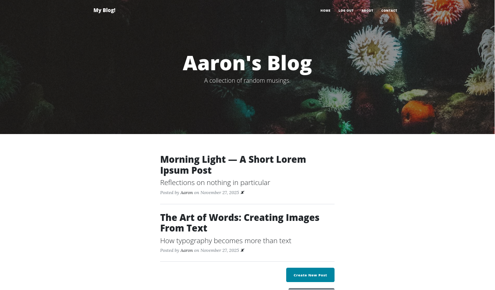
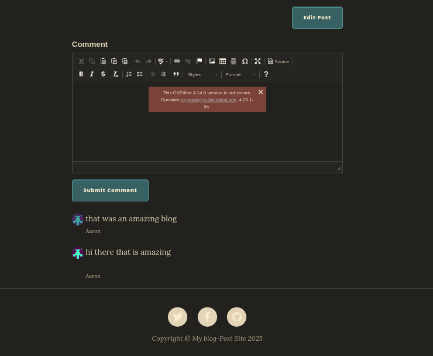
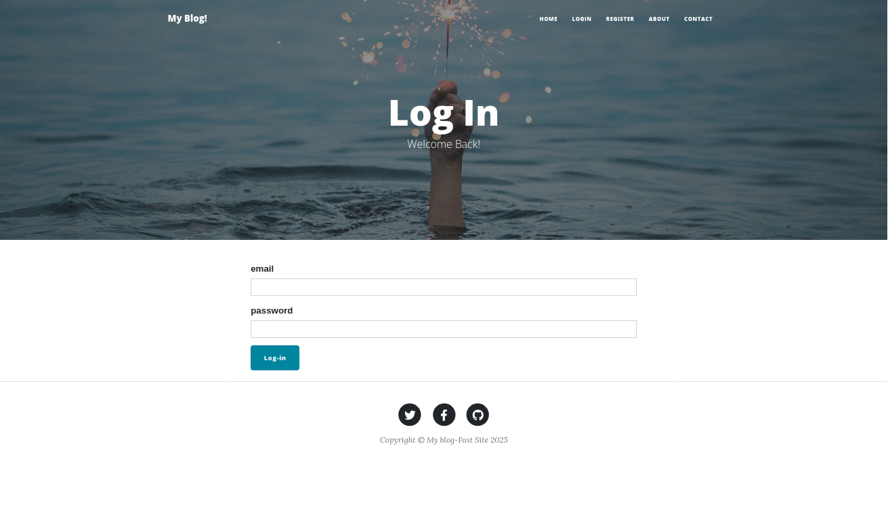
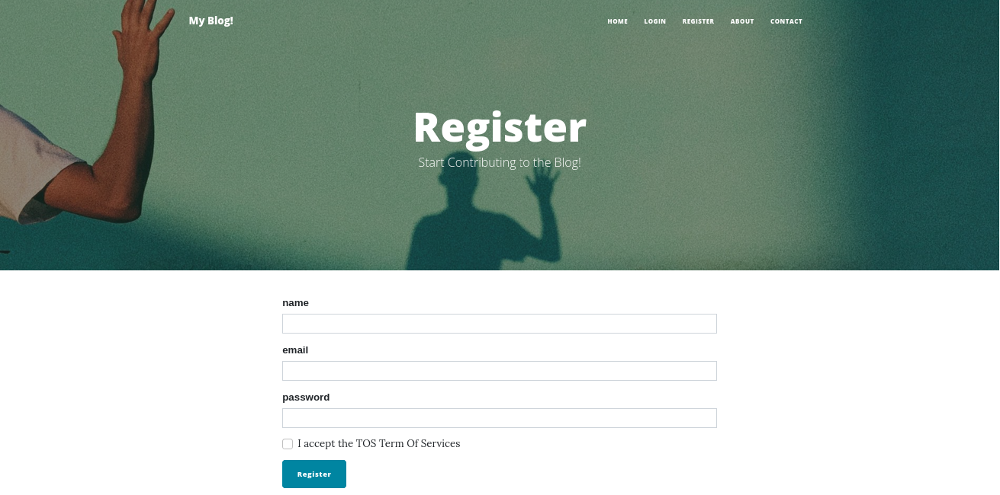

# Flask-CMS-Blog: A Full-Stack Python Blog Platform

> A robust multi-user content management system built with Flask, SQLAlchemy, and Bootstrap.


*(A fully responsive blog layout with authentication and comment systems)*

## About The Project

This application is a fully functional blog platform that demonstrates advanced backend concepts in Python. It moves beyond simple static sites by implementing a relational database structure, secure user authentication, and role-based access control (RBAC).

The goal was to build a secure, scalable platform where users can register, manage their profiles, and engage in discussions via comments, while restricting sensitive administrative actions (like deleting posts) to authorized personnel only.

## Features

### Authentication & Security
* **Secure Registration/Login:** Built with `Flask-Login` and `Werkzeug` security hashing.
* **Session Management:** Persistent user sessions with "Remember Me" functionality.
* **Route Protection:** Decorators protect sensitive routes from unauthorized access.

### Role-Based Access Control (RBAC)
* **Admin Privileges:** Only the Admin (User ID: 1) can Create, Edit, or Delete posts.
* **User Privileges:** Standard users can read posts and leave comments.
* **Guest Limits:** Guests can read content but must register to interact.

### Database Architecture
* **Relational Models:** Utilizes SQLAlchemy for One-to-Many relationships:
    * User ➔ Posts (One User writes many Posts)
    * User ➔ Comments (One User writes many Comments)
    * Post ➔ Comments (One Post has many Comments)
* **Cascade Deletion:** deleting a post automatically cleans up associated orphaned comments.

### User Experience
* **Rich Text Editor:** Integrated `CKEditor` allows for formatted blog posts (bold, list, images).
* **Gravatar Integration:** Profile pictures are automatically fetched based on user email addresses.
* **Responsive Design:** Styled with Bootstrap 5 for mobile and desktop compatibility.

## Technical Stack

* **Backend:** Python 3.10+, Flask
* **Database:** SQLite, SQLAlchemy (ORM)
* **Frontend:** HTML5, CSS3, Bootstrap 5, Jinja2 Templating
* **Forms:** Flask-WTF, WTForms
* **Editor:** Flask-CKEditor

## 💻 How to Run This Project

1.  **Clone the Repository**
    ```bash
    git clone [https://github.com/YOUR-USERNAME/Flask-CMS-Blog.git](https://github.com/YOUR-USERNAME/Flask-CMS-Blog.git)
    cd Flask-CMS-Blog
    ```

2.  **Install Dependencies**
    It is recommended to use a virtual environment.
    ```bash
    pip install -r requirements.txt
    ```

3.  **Run the Application**
    ```bash
    python main.py
    ```

4.  **Access the App**
    Open your browser and navigate to `http://127.0.0.1:5002`

## 📸 More Previews

| Rich Text Editor | Comment System |
| :---: | :---: |
|  |  |
|  |  |

##  Contact

**Aaron** - [GitHub Profile](https://github.com/Aaron-pweb)

**Aaron's Perspective on Telegram** - [Telegram](https://t.me/The_Aaron_perspective)

Project Link: [https://github.com/Aaron-pweb/Flask-CMS-Blog](https://github.com/Aaron-pweb/Flask-CMS-Blog)
